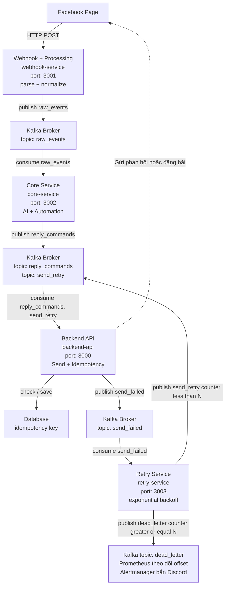

# Kế hoạch Triển khai Hệ thống Facebook Page API (Microservices)

Tài liệu này mô tả kiến trúc và kế hoạch triển khai cho hệ thống quản lý Facebook Page, bao gồm 4 microservices độc lập giao tiếp với nhau thông qua Kafka.

---

## 1. Kiến trúc Tổng thể & Luồng Dữ liệu (Data Flow)

Hệ thống được chia thành 4 service riêng biệt để phân tách trách nhiệm (Separation of Concerns), đảm bảo khả năng mở rộng và độ tin cậy.

```text
[Facebook Webhook]
       ↓ HTTP POST
[webhook-service (3001)] ──(xác thực HMAC, normalize)──> Kafka: raw_events
                                                                ↓
[core-service (3002)] <─────────────────────────────────────────┘
       │ (Phân tích AI Intent/Sentiment)
       │ (Rule Engine Automation: reply/hide/blacklist)
       └──> Kafka: reply_commands ──┐
                                    ↓
[backend-api (3000)] <──────────────┘<──┐
       │ (Idempotency Check DB)         │
       │ (Call Facebook Graph API)      │ Kafka: send_retry
       ├──> [Thành công] ──> Save DB    │
       └──> [Thất bại] ────> Kafka: send_failed ──┐
                                                  ↓
[retry-service (3003)] <──────────────────────────┘
       │ (Exponential backoff)
       ├──> [retry < N] ──> Kafka: send_retry
       └──> [retry >= N] ─> Kafka: dead_letter ──> (Prometheus/Alertmanager)
```

### Các Topic Kafka sử dụng:
- `raw_events`: Chứa payload đã được webhook-service chuẩn hóa (normalize). Consumer: `core-service`.
- `reply_commands`: Chứa quyết định hành động (ẩn, reply...) từ core-service. Consumer: `backend-api`.
- `send_retry`: Chứa message cần gửi lại do lỗi trước đó. Consumer: `backend-api`.
- `send_failed`: Chứa message gọi Graph API thất bại. Consumer: `retry-service`.
- `dead_letter`: Chứa message đã retry hết số lần tối đa mà vẫn lỗi. Admin xử lý thủ công.

---



## 2. Chi tiết Các Services

### 2.1 Webhook + Processing (`webhook-service`, port 3001)
- **Nhiệm vụ:** Nhận event từ Facebook webhook.
- **Xử lý:**
  - Xác thực chữ ký `X-Hub-Signature-256` bằng HMAC-SHA256 để chống giả mạo.
  - Parse JSON payload.
  - Normalize về một schema chuẩn nội bộ chung cho cả comment và message.
  - Publish event đã chuẩn hóa vào topic `raw_events`.
- **Yêu cầu quan trọng:** Trả về HTTP `200 OK` cho Facebook càng nhanh càng tốt để tránh Meta retry request và block webhook.

### 2.2 Core Service (`core-service`, port 3002)
- **Nhiệm vụ:** Trí tuệ nhân tạo (AI) và Automation Rule Engine.
- **Consumer:** Subscribe topic `raw_events`.
- **Bước 1 - AI Analysis:**
  - Gọi LLM (Gemini API hoặc tương đương) để phân loại **Intent** (hỏi giá, khiếu nại, spam...) và phân tích **Sentiment** (tích cực, trung tính, tiêu cực).
  - **Timeout cứng:** Giới hạn thời gian gọi AI tối đa 5 giây. Nếu quá thời hạn, áp dụng Fallback.
  - *Fallback:* Nếu AI API chậm/lỗi, gán nhãn mặc định (`intent: unknown`, `sentiment: neutral`) và vẫn publish `reply_commands` để pipeline không bị block.
- **Bước 2 - Automation Rule Engine:**
  - Quyết định hành động dựa trên kết quả AI: tự động reply, ẩn bình luận (hide), duyệt thủ công (manual review), hoặc blacklist.
  - Nếu user tái phạm nhiều lần, đánh dấu blacklist và **lưu vào PostgreSQL** (bảng `user_blacklist`) để trạng thái không mất khi service restart.
- **Producer:** Publish kết quả quyết định hành động vào topic `reply_commands`.
- **Health Check:** Có mở endpoint để monitor.

### 2.3 Backend API (`backend-api`, port 3000)
- **Nhiệm vụ:** Thực thi gọi Facebook Graph API và cung cấp REST API cho Dashboard.
- **Độc quyền:** Là service **DUY NHẤT** được cấp quyền và cấu hình để gọi Facebook Graph API.
- **Consumer:** Subscribe topic `reply_commands` và `send_retry`.
- **Xử lý Command (Idempotency):**
  - Kiểm tra `idempotency_key` trong Database (ví dụ: `command_id` + `action_type`).
  - Nếu đã xử lý thành công trước đó -> Bỏ qua (tránh Kafka redeliver gây duplicate).
  - Tiến hành gọi Facebook Graph API.
  - Nếu thành công: Lưu `idempotency_key` vào Database.
  - Nếu thất bại (timeout, 5xx): Publish message vào topic `send_failed`, **giữ nguyên `retry_count`** từ message đang xử lý (không reset về 0).

### 2.4 Retry Service (`retry-service`, port 3003)
- **Nhiệm vụ:** Quản lý hàng đợi lỗi và retry bằng Exponential Backoff.
- **Consumer:** Subscribe topic `send_failed`.
- **Xử lý:**
  - Đọc thuộc tính `retry_count` từ message.
  - Tính thời gian chờ (Delay): $1s \times 2^{retry\_count}$.
  - Thực hiện chờ (có thể dùng task delay hoặc luân chuyển qua DB queue nếu delay lớn).
  - Nếu `retry_count < N` (ví dụ N=3): Tăng `retry_count`, publish lại vào topic `send_retry`.
  - Nếu `retry_count >= N`: Publish vào topic `dead_letter` và dừng.

### 2.5 Database & Dead Letter Queue
- **Database (PostgreSQL):** Lưu thông tin Idempotency (bảng `processed_commands`) để Backend API kiểm tra. Lưu config, blacklist, và thông tin Dashboard.
- **Dead Letter Queue (Kafka Topic `dead_letter`):** Lưu vĩnh viễn các message quá số lần retry. Có tích hợp Prometheus theo dõi offset và Alertmanager bắn cảnh báo Discord cho Admin. Admin dùng Kafdrop để review.

---

## 2.5 Chuẩn message giữa các service
Hệ thống sử dụng định dạng JSON, thống nhất các trường định danh và hỗ trợ versioning.

### raw_events (từ Webhook -> Core)
```json
{
  "schema_version": 1,
  "event_id": "evt_001",
  "event_type": "comment_created",
  "source": "facebook",
  "page_id": "123456789",
  "post_id": "post_001",
  "comment_id": "cmt_001",
  "user_id": "user_001",
  "message": "Shop oi gia bao nhieu?",
  "created_at": "2026-04-26T09:30:00Z"
}
```

### reply_commands (từ Core -> Backend API)
```json
{
  "schema_version": 1,
  "command_id": "cmd_001",
  "event_id": "evt_001",
  "action": "reply",
  "target": {
    "page_id": "123456789",
    "comment_id": "cmt_001"
  },
  "reply_text": "Da shop da gui thong tin chi tiet qua inbox.",
  "intent": "ask_price",
  "sentiment": "neutral",
  "created_at": "2026-04-26T09:31:00Z"
}
```

### send_failed / send_retry (từ Backend API <-> Retry Service)
> ⚠️ `payload` **phải chứa đủ thông tin để retry** — bao gồm cả `target` để Backend API biết reply vào comment nào khi consume lại từ `send_retry`.

```json
{
  "schema_version": 1,
  "command_id": "cmd_001",
  "event_id": "evt_001",
  "retry_count": 1,
  "last_error": "Facebook API timeout",
  "next_retry_at": "2026-04-26T09:31:05Z",
  "payload": {
    "action": "reply",
    "target": {
      "page_id": "123456789",
      "comment_id": "cmt_001"
    },
    "reply_text": "Da shop da gui thong tin chi tiet qua inbox."
  }
}
```

### dead_letter (Lưu trữ lỗi cuối cùng)
```json
{
  "schema_version": 1,
  "command_id": "cmd_001",
  "event_id": "evt_001",
  "retry_count": 3,
  "failed_at": "2026-04-26T09:33:00Z",
  "final_error": "Facebook API timeout after maximum retries",
  "original_topic": "send_failed",
  "payload": {
    "action": "reply",
    "target": {
      "page_id": "123456789",
      "comment_id": "cmt_001"
    },
    "reply_text": "Da shop da gui thong tin chi tiet qua inbox."
  }
}
```

---

## 3. Quy ước Đặt tên & Port
| Service | Thư mục/Repo | Port | Mô tả |
|---|---|---|---|
| **Backend API** | `backend-api/` | `3000` | REST API, FB Graph API, DB Idempotency |
| **Webhook Service** | `webhook-service/` | `3001` | HMAC Verify, Normalize, Produce `raw_events` |
| **Core Service** | `core-service/` | `3002` | AI Analysis, Automation Rules |
| **Retry Service** | `retry-service/` | `3003` | Exponential backoff, DLQ routing |

---

## 4. Bài 3 - AI Sentiment Automation

Bài 3 không tạo thêm service mới. Luồng vẫn là:

```text
raw_events -> core-service -> reply_commands -> backend-api -> Facebook Graph API
```

Phần khác biệt nằm ở `core-service`: kết quả AI sentiment được dùng trực tiếp để chọn action.

| Sentiment / intent | Action | Lý do |
|---|---|---|
| `positive` hoặc `praise` | `reply` cảm ơn | Tự động phản hồi bình luận tích cực |
| `neutral` hoặc `neutral_feedback` | `reply` ghi nhận | Cho thấy hệ thống hiểu nội dung trung tính, không chỉ spam/complaint |
| `negative` hoặc `complaint` | `reply` xin lỗi và tạo `manual_review_items` | Bám yêu cầu Bài 3 nhưng vẫn an toàn cho khiếu nại thật |
| `spam` | `hide_and_review` | Ẩn comment rủi ro và giữ dấu vết để admin xem lại |

Gemini được dùng khi có key hợp lệ. Nếu Gemini lỗi, hết quota, hoặc circuit breaker mở, Core Service fallback sang rule-based classification để pipeline không bị dừng.

Các cơ chế bắt buộc của Bài 3 được giữ ở các vị trí sau:

- Retry exponential backoff: `retry-service`, topic `send_failed -> send_retry -> dead_letter`.
- Circuit breaker: `backend-api` cho Facebook Graph API và `core-service` cho Gemini.
- Idempotency: `processed_commands(command_id, action)` ở PostgreSQL.
- DLQ + alert: topic `dead_letter`, Prometheus rule `DeadLetterQueueReceived`, Alertmanager gửi Discord.
