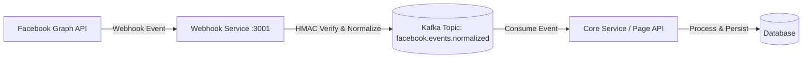

# Webhook + Kafka Realtime Event Pipeline

## 📍 Summary

Xây dựng `webhook-service` là một project ASP.NET Core độc lập trong solution để xử lý luồng sự kiện realtime từ Facebook Page. Service này đóng vai trò là Gateway tiếp nhận Webhooks, xác thực bảo mật, chuẩn hóa dữ liệu (normalize) và đẩy vào hệ thống Message Queue (Kafka) để các Core Service khác xử lý.

## 🏗️ Architecture Overview



---

## 🛠️ Prerequisites & Dependencies

### 1. Runtimes & SDKs

*   **[.NET 8 SDK](https://dotnet.microsoft.com/download/dotnet/8.0):** Framework chính để phát triển Webhook Service.
*   **[Docker Desktop](https://www.docker.com/products/docker-desktop/):** Cần thiết để chạy Kafka, Zookeeper và Kafka UI local.

### 2. NuGet Packages (Cần cài đặt trong Code)

*   `Confluent.Kafka`: Thư viện chính để làm việc với Kafka (Producer/Consumer).
*   `Newtonsoft.Json`: (Tùy chọn) Hỗ trợ parse JSON linh hoạt từ Facebook Webhooks.

### 3. External Tools & Services

*   **[ngrok](https://ngrok.com/) hoặc [cloudflared](https://developers.cloudflare.com/cloudflare-one/connections/connect-networks/):** Tạo public HTTPS tunnel để Meta có thể gửi Webhook tới localhost của bạn.
*   **Kafka UI (Docker Image):** `provectuslabs/kafka-ui` - Khuyên dùng để quan sát message trong Kafka trực quan hơn.
*   **Meta Graph API Explorer:** Công cụ web để test và lấy Access Token nhanh chóng.

### 4. Meta Setup

*   **Facebook Developer App:** Phải có `App ID` và `App Secret`.
*   **Page Access Token:** Token có quyền `pages_manage_metadata` và `pages_read_engagement`.

---

### Run Guide (Copy/Paste)

1.  **Start Kafka + Zookeeper**
    ```powershell
    docker compose -f "d:\coding for Future\Page-API\docker-compose.yml" up -d
    ```
2.  **Run WebhookService**
    ```powershell
    dotnet run --project "d:\coding for Future\Page-API\Page API\WebhookService\WebhookService.csproj"
    ```
3.  **Run Page API (Kafka Consumer)**
    ```powershell
    dotnet run --project "d:\coding for Future\Page-API\Page API\Page API\Page API.csproj"
    ```
4.  **Check webhook health**
    ```powershell
    Invoke-WebRequest -Uri "http://localhost:3001/health" -UseBasicParsing
    ```
    *   Kỳ vọng: HTTP `200 OK`.
5.  **Trigger event**
    *   Cách 1: Comment thật trên post của Facebook Page đã subscribe field `feed`.
    *   Cách 2: Dùng nút `Test` của field `feed` trong Meta Webhooks Dashboard.
6.  **Verify logs**
    *   `WebhookService` có log dạng: `Kafka published eventId=... topic=facebook.events.normalized`.
    *   `Page API` có log dạng: `Processed facebook event EventId=...`.
7.  **Pass criteria**
    *   Có message mới trong topic `facebook.events.normalized`.
    *   `Page API` consume và xử lý thành công event.

## 🛠️ Public Interfaces

| Endpoint | Method | Description |
| :--- | :--- | :--- |
| `/webhook` | `GET` | Facebook callback verification |
| `/webhook` | `POST` | Receive Facebook webhook events |
| `/health` | `GET` | Service health check |

---

## 🧪 Test Plan

*   **Unit Tests:**
    *   Verify Token logic cho `GET /webhook`.
    *   HMAC Signature validation cho `POST /webhook`.
    *   Normalizer logic cho các mẫu payload Facebook comment.
*   **Integration Tests:**
    *   Kiểm tra khả năng kết nối và publish message tới Kafka (Docker Compose).
*   **Manual Tests:**
    *   Sử dụng Meta Webhooks Dashboard (Test tool).
    *   Thực hiện comment thật trên Facebook Page để kiểm tra realtime pipeline.

---

## 📌 Assumptions

*   `webhook-service` nằm trong cùng solution nhưng chạy độc lập để dễ scale.
*   Hỗ trợ comment trước, các event khác (like, share, message) sẽ mở rộng sau.
*   Môi trường dev local yêu cầu Tunnel (ngrok) để Meta có thể gửi request qua HTTPS.
