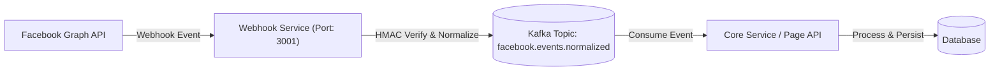

# Technical Specification: Facebook Webhook and Kafka Realtime Event Pipeline

## 1. Project Overview

Dự án này tập trung vào việc thiết lập hệ thống xử lý sự kiện thời gian thực (real-time) từ nền tảng Facebook Webhooks. Hệ thống được thiết kế theo kiến trúc hướng sự kiện (Event-Driven Architecture) với hai thành phần chính:

- **WebhookService**: Đóng vai trò là Gateway tiếp nhận yêu cầu từ Meta, thực hiện xác thực chữ ký HMAC, chuẩn hóa dữ liệu và đẩy vào hệ thống hàng đợi Kafka.
- **Page API**: Đóng vai trò là Consumer, tiếp nhận dữ liệu từ Kafka để thực thi các logic nghiệp vụ và lưu trữ thông tin vào cơ sở dữ liệu.

## 2. System Architecture

Hệ thống được tổ chức theo quy trình luồng dữ liệu dưới đây:



## 3. Technical Prerequisites

### 3.1. Environments and SDKs

- **.NET 8 SDK**: Nền tảng phát triển chính cho các dịch vụ phía Backend.
- **Docker Desktop**: Yêu cầu để vận hành hạ tầng Kafka, Zookeeper và các công cụ quản trị liên quan.

### 3.2. Supporting Infrastructure

- **ngrok / Cloudflare Tunnel**: Công cụ tạo HTTPS tunnel để nhận request từ Meta tới môi trường local.
- **Kafka UI**: Giao diện quản trị Kafka, mặc định truy cập tại địa chỉ `http://localhost:8080`.

## 4. Deployment Guide

Yêu cầu thực hiện các câu lệnh từ thư mục gốc của dự án (Root Directory).

### Bước 1: Khởi tạo hạ tầng dịch vụ

Sử dụng Docker Compose để triển khai Kafka và các dịch vụ phụ trợ:

```powershell
docker compose up -d
```

### Bước 2: Vận hành Webhook Service

Mở terminal và khởi động dịch vụ tiếp nhận webhook:

```powershell
dotnet run --project "Page API/WebhookService/WebhookService.csproj"
```

Mặc định dịch vụ sẽ lắng nghe tại cổng 3001.

### Bước 3: Vận hành Core API (Kafka Consumer)

Khởi động dịch vụ xử lý dữ liệu từ hàng đợi:

```powershell
dotnet run --project "Page API/Page API/Page API.csproj"
```

### Bước 4: Xác thực trạng thái hoạt động

Kiểm tra tình trạng kết nối của Webhook Service:

```powershell
Invoke-WebRequest -Uri "http://localhost:3001/health" -UseBasicParsing
```

Kết quả mong đợi: Trạng thái HTTP 200 OK.

## 5. Configuration and Integration

### 5.1. Facebook Webhook Setup

Để tích hợp với Meta Webhooks, cần thực hiện các cấu hình sau:

1.  **Endpoint URL**: Sử dụng địa chỉ HTTPS được cấp bởi ngrok (ví dụ: `https://your-domain.ngrok-free.app/webhook`).
2.  **Verify Token**: Giá trị token phải khớp với cấu hình trong file `appsettings.json` của WebhookService.
3.  **Subscription Fields**: Đăng ký theo dõi trường `feed` để nhận các sự kiện bài viết và bình luận.

### 5.2. Security Verification

Hệ thống bắt buộc kiểm tra chữ ký `X-Hub-Signature-256` trong Header của mỗi request POST để đảm bảo tính toàn vẹn và xác thực nguồn gốc từ Meta.

## 6. Verification and Testing

### 6.1. Manual Verification

Sử dụng công cụ Test Tool trong Meta Developer Dashboard để gửi các sự kiện giả lập. Kiểm tra nhật ký hệ thống (logs) để xác nhận luồng dữ liệu:

- **WebhookService Log**: Xác nhận thông báo `Kafka published eventId=...`.
- **Page API Log**: Xác nhận thông báo `Processed facebook event EventId=...`.

### 6.2. Monitoring

Người dùng có thể truy cập Kafka UI tại `http://localhost:8080` để kiểm tra trạng thái các topic và số lượng message đang tồn đọng trong hàng đợi.

## 7. Public API Interfaces

| Endpoint   | Method | Functionality                                        |
| :--------- | :----- | :--------------------------------------------------- |
| `/webhook` | `GET`  | Thực hiện quy trình xác thực (Challenge) với Meta    |
| `/webhook` | `POST` | Tiếp nhận và xử lý payload sự kiện từ Facebook       |
| `/health`  | `GET`  | Cung cấp thông tin trạng thái hoạt động của hệ thống |

## 8. Operational Notes

- **HTTPS Requirement**: Meta yêu cầu bắt buộc sử dụng giao thức HTTPS cho Callback URL.
- **Latency**: Do sử dụng Kafka, dữ liệu có thể có độ trễ nhỏ tùy thuộc vào cấu hình của Consumer.
- **Scaling**: WebhookService được thiết kế độc lập, cho phép mở rộng quy mô (Scale-out) dễ dàng khi lưu lượng sự kiện tăng cao.
