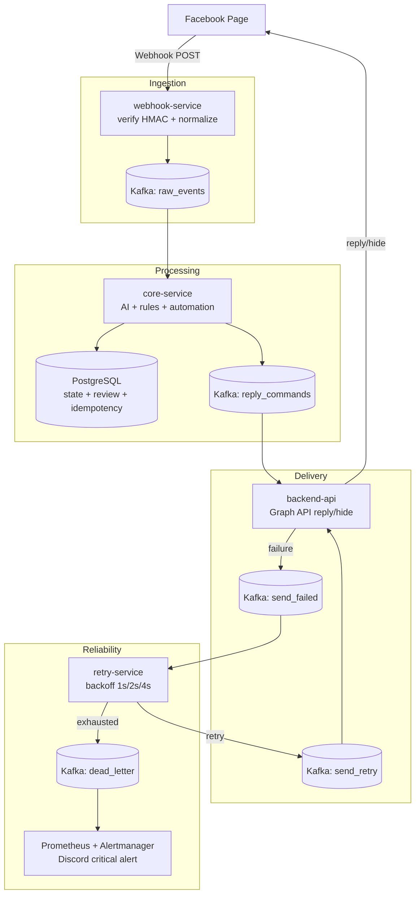

# Facebook Page API Microservices

Dự án này là hệ thống microservice phục vụ bài thực hành tích hợp Facebook Page API. Hệ thống nhận sự kiện bình luận/tin nhắn từ Facebook Webhook, xử lý nội dung bằng rule và AI, tự động phản hồi hoặc ẩn bình luận, đồng thời có pipeline retry, dead letter queue và cảnh báo vận hành.

README chỉ mô tả tổng quan dự án. Hướng dẫn chạy, cấu hình và bộ test demo nằm trong thư mục [Docs](./Docs/).

## Hệ thống làm được gì

- Nhận webhook từ Facebook Page và xác thực chữ ký `X-Hub-Signature-256`.
- Chuẩn hóa event comment/message thành message nội bộ và publish vào Kafka.
- Phân tích nội dung bình luận theo intent và sentiment:
  - hỏi giá/tư vấn;
  - phản hồi tích cực;
  - phản hồi trung tính;
  - phản hồi tiêu cực/khiếu nại;
  - spam/link lạ;
  - nội dung chưa rõ cần manual review.
- Tự động hóa hành động:
  - positive -> trả lời cảm ơn;
  - neutral -> ghi nhận ý kiến;
  - negative/complaint -> xin lỗi và đưa vào manual review;
  - spam -> ẩn bình luận và review;
  - unknown/rate limit -> manual review, không auto reply.
- Gọi Facebook Graph API để reply/hide comment.
- Có idempotency để tránh gửi trùng reply khi Kafka consume lại message.
- Có retry với exponential backoff và giới hạn số lần thử.
- Có dead letter queue cho message lỗi cuối cùng.
- Có Prometheus, Alertmanager, Kafka Exporter và Discord alert cho DLQ.
- Có test tự động cho các logic trọng yếu và bộ test thủ công trên Facebook Page thật.

## Kiến trúc tổng quan

Dự án được tổ chức theo kiến trúc microservice dạng monorepo. Mỗi service là một project/process riêng, giao tiếp bất đồng bộ qua Kafka topic.

## Các service chính

| Service | Vai trò |
|---|---|
| `webhook-service` | Nhận webhook từ Facebook, verify request, normalize event, publish `raw_events`. |
| `core-service` | Consume `raw_events`, phân tích AI/rule, phát hiện spam/rate limit, lưu trạng thái, publish `reply_commands`. |
| `backend-api` | Cung cấp admin API proxy Facebook Graph API, consume `reply_commands` và `send_retry`, xử lý idempotency, reply/hide comment, publish `send_failed` khi lỗi. |
| `retry-service` | Consume `send_failed`, lập lịch retry theo exponential backoff, publish `send_retry` hoặc `dead_letter`. |
| `shared/PageApi.Shared` | Chứa Kafka contracts, topic names, retry planner, circuit breaker, core decision rules và schema SQL dùng chung. |

## Hạ tầng sử dụng

- Kafka + Zookeeper: message broker cho pipeline realtime.
- PostgreSQL: lưu trạng thái event, idempotency, review, blacklist.
- Kafka UI: quan sát topic/message.
- Prometheus + Kafka Exporter: theo dõi Kafka offset/lag.
- Alertmanager: route alert vận hành.
- Discord webhook: nhận cảnh báo critical, đặc biệt là DLQ.

## Kafka topics

| Topic | Mục đích |
|---|---|
| `raw_events` | Event đã normalize từ webhook-service. |
| `reply_commands` | Lệnh reply/hide/manual-review do core-service tạo. |
| `send_retry` | Lệnh cần gửi lại sau retry. |
| `send_failed` | Lệnh gọi Facebook API thất bại. |
| `dead_letter` | Message đã retry hết số lần cho phép và cần xử lý thủ công. |

## Kết quả demo

Kết quả demo được tổng hợp trong [RESULT.md](./RESULT.md), gồm các nhóm bằng chứng chính:

- User A: Page tự động reply cho hỏi giá, positive, neutral và negative comment.
- User B: spam link/keyword bị hide và không hiển thị ở góc nhìn người khác.
- User C: unknown/rate-limit không bị auto reply sai.
- Page: comment do chính Page tạo không gây vòng lặp tự reply.
- Retry: `send_failed -> send_retry -> dead_letter` hoạt động đúng.
- Monitoring: Kafka UI, Prometheus, Alertmanager và Discord chứng minh DLQ alert.

## Tài liệu hướng dẫn

- [Project-Guide.md](./Docs/Project-Guide.md): hướng dẫn cấu hình, chạy hạ tầng và chạy các service.
- [Test-Dataset.md](./Docs/Test-Dataset.md): bộ comment/test case cho Bài 2, Bài 3, spam, rate limit, Page self-reply, retry, DLQ và alert.
- [System_design.md](./Docs/System_design.md): mô tả kiến trúc, luồng dữ liệu, topic và cơ chế reliability.
