# Kết quả demo 

Tài liệu này tổng hợp kết quả demo dựa trên bộ test trong [Docs/Test-Dataset.md](./Docs/Test-Dataset.md). Mỗi phần bên dưới tương ứng với một nhóm test chính và dùng ảnh trong thư mục [assets](./assets/) làm bằng chứng.

## 1. User A - Reply automation

Mục tiêu: kiểm tra các comment bình thường được phân loại đúng intent/sentiment và Page tự động phản hồi phù hợp.

| Case | Comment | Kết quả mong đợi | Kết quả demo |
|---|---|---|---|
| A1 | `Shop ơi giá bao nhiêu?` | `ask_price`, reply tư vấn | Page trả lời thông tin sẽ gửi chi tiết |
| A2 | `Bài viết hay quá` | `praise`, positive reply | Page trả lời cảm ơn |
| A3 | `Dịch vụ rất tốt, mình sẽ quay lại` | `praise`, positive reply | Page trả lời cảm ơn |
| A4 | `Sản phẩm tạm ổn` | `neutral_feedback`, neutral reply | Page ghi nhận ý kiến |
| A5 | `Mình chưa nhận được hàng` | `complaint`, negative reply | Page xin lỗi và kiểm tra |
| A6 | `Trải nghiệm quá tệ` | `complaint`, negative reply | Page xin lỗi và kiểm tra |

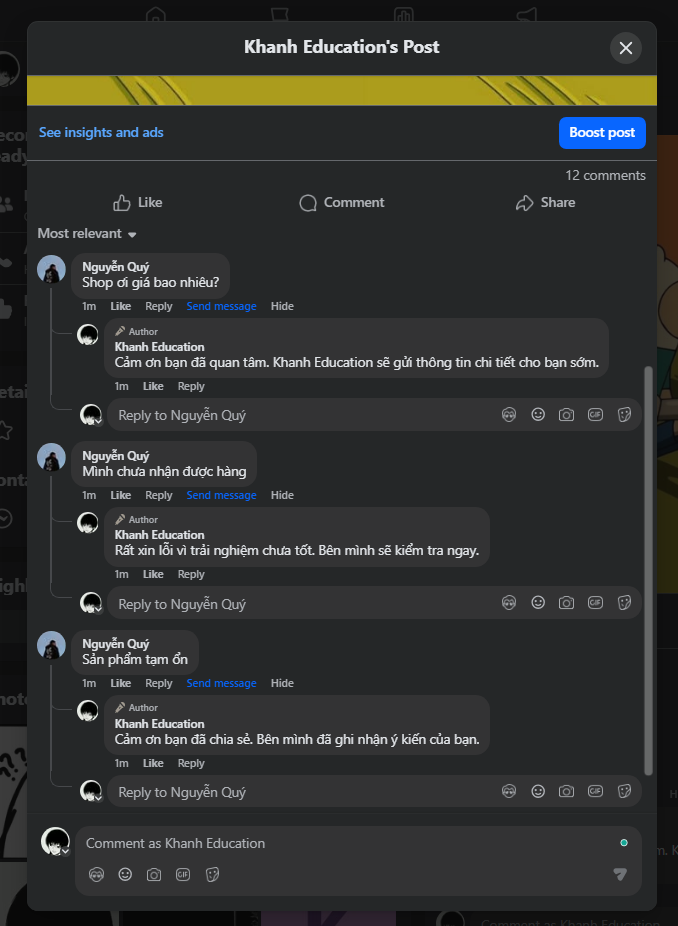

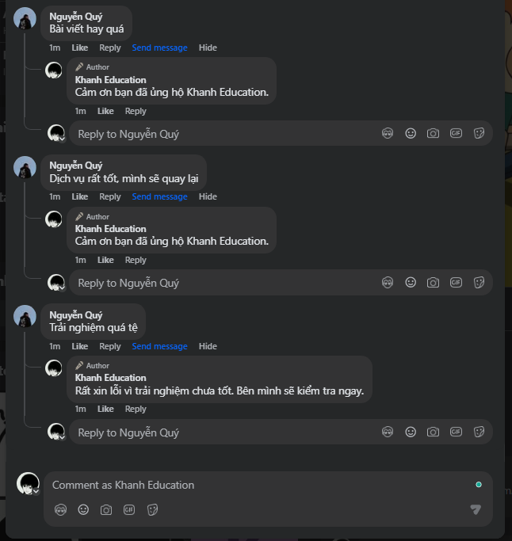

Kết luận: User A chứng minh luồng tự động phản hồi cho các nhóm hỏi giá, tích cực, trung tính và tiêu cực hoạt động đúng.

## 2. User B - Spam, hide, blacklist

Mục tiêu: kiểm tra spam link/keyword bị phát hiện và ẩn khỏi góc nhìn người khác.

| Case | Comment | Kết quả mong đợi | Kết quả demo |
|---|---|---|---|
| B1 | `Xem ngay ưu đãi tại http://spam-example.test` | Spam link, hide comment | Không thấy ở góc nhìn người khác |
| B2 | `Nhận quà tại telegram abc` | Spam keyword, hide comment | Không thấy ở góc nhìn người khác |
| B3/B4 | `Quảng cáo lặp lại http://spam-example.test` | Spam lặp, hide và tăng spam count | Không thấy ở góc nhìn người khác |
| B5 | `Shop tư vấn giúp` | Nếu user đã blacklist thì không auto reply | Comment thường vẫn hiển thị, không bị xử lý như spam |

Ảnh dưới đây là góc nhìn của User B, nên người tạo comment vẫn thấy các comment của chính mình:

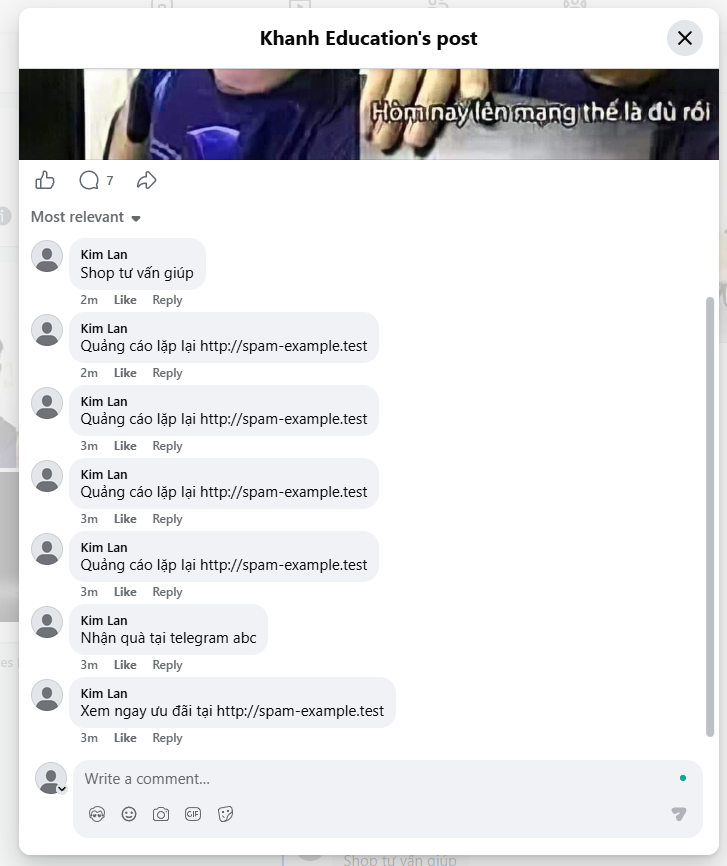

Ảnh dưới đây là góc nhìn Page/người khác, chỉ còn comment không spam hiển thị:

Kết luận: User B chứng minh rule spam/link/keyword hoạt động và action hide có hiệu lực trên Facebook UI.

## 3. User C - Unknown và rate limit

Mục tiêu: kiểm tra nội dung không rõ ý định không bị auto reply, đồng thời rate limit không bị nhầm thành negative sentiment.

| Case | Comment | Kết quả mong đợi | Kết quả demo |
|---|---|---|---|
| C1 | `abc xyz` | `unknown`, manual review, không auto reply | Không có Page reply |
| C2 | `rate test 01...` | Trước ngưỡng: unknown/manual review; vượt ngưỡng: rate limited | Các comment rate test không bị Page reply |

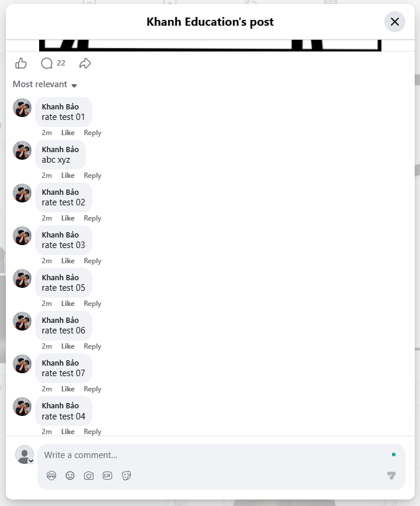

Kết luận: User C chứng minh unknown/manual review không tạo reply tự động và lỗi false positive `rate test` thành negative đã được xử lý.

## 4. Page - Chặn vòng lặp Page tự reply

Mục tiêu: kiểm tra comment do chính Page tạo không bị webhook xử lý lại, tránh vòng lặp Page tự reply.

| Case | Cách test | Kết quả mong đợi | Kết quả demo |
|---|---|---|---|
| P1 | Page tự comment/reply | Webhook normalizer bỏ qua Page-authored event | Không có reply lặp lại |

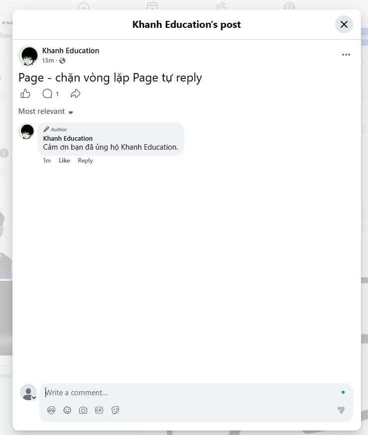

Kết luận: Page-authored event được bỏ qua đúng cách, không tạo vòng lặp auto reply.

## 5. Retry và send_retry

Mục tiêu: kiểm tra message lỗi tạm thời được đưa vào retry topic với retry count mới.

| Case | Cách test | Kết quả mong đợi | Kết quả demo |
|---|---|---|---|
| R2 | Đẩy message vào `send_failed` với `retry_count=2` | `retry-service` publish sang `send_retry` với `retry_count=3` | Console consumer thấy message trong `send_retry` |
| R3 | Đẩy message vào `send_failed` với `retry_count=3` | Hết lượt retry, message vào `dead_letter` | Console consumer thấy message trong `dead_letter` |

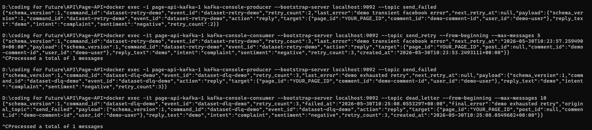

Kết luận: retry-service xử lý đúng nhánh retry còn lượt và nhánh hết lượt đưa vào DLQ.

## 6. Dead letter queue và cảnh báo vận hành

Mục tiêu: kiểm tra message vào `dead_letter` được lưu lại, Prometheus phát hiện offset tăng, Alertmanager route alert và Discord nhận thông báo.

| Thành phần | Kết quả mong đợi | Kết quả demo |
|---|---|---|
| Kafka UI | Topic `dead_letter` có message lỗi cuối cùng | Thấy message `dataset-dlq-demo`, `retry_count=3`, `origin_topic=send_failed` |
| Prometheus | Alert `DeadLetterQueueReceived` firing khi offset tăng | Alert chuyển sang `FIRING` |
| Prometheus sau đó | Alert resolve khi cửa sổ tăng offset kết thúc | Alert về `INACTIVE` |
| Alertmanager | Nhận alert và route tới receiver Discord | Receiver `discord-notifications` nhận alert |
| Discord | Nhận thông báo firing và resolved | Bot Discord gửi cả `[FIRING]` và `[RESOLVED]` |

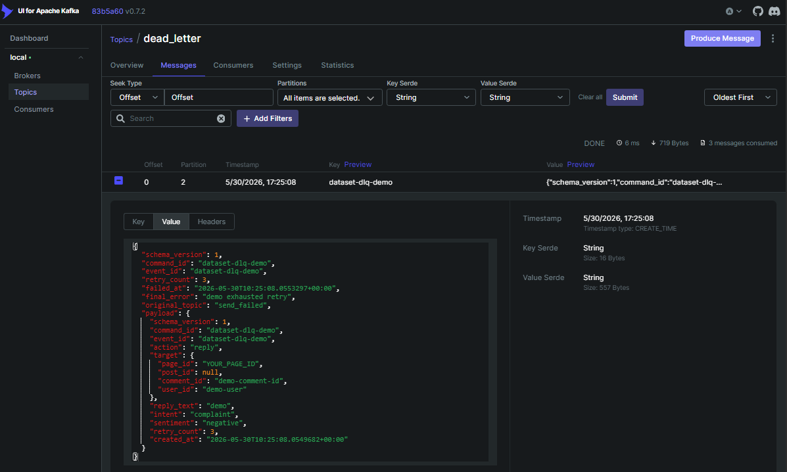

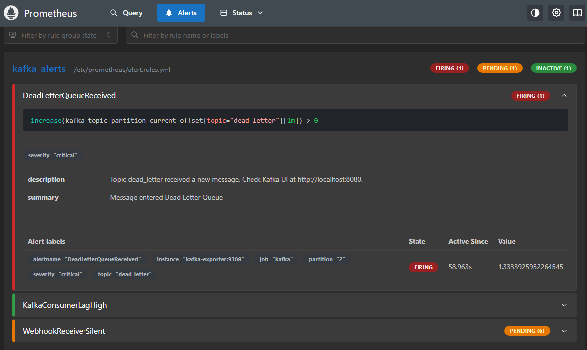

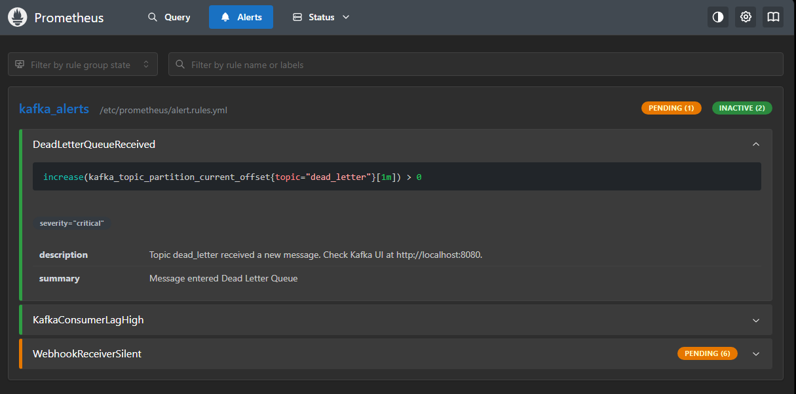

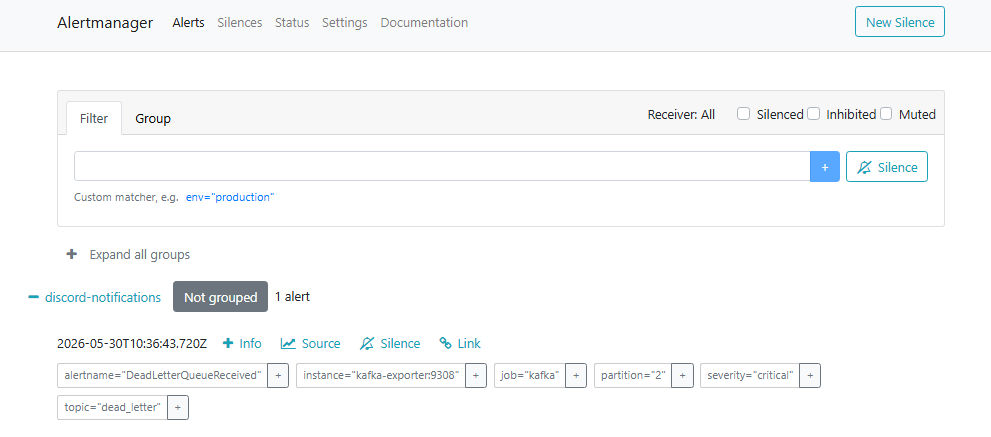

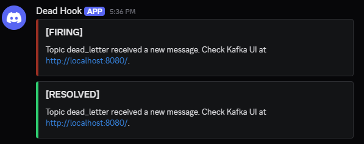

Kết luận: DLQ và alert chain hoạt động đúng: `dead_letter -> Prometheus -> Alertmanager -> Discord`.

## 7. Tổng kết

Các ảnh demo trong thư mục `assets` chứng minh các yêu cầu chính đã hoạt động:

- Facebook webhook pipeline xử lý comment thật.
- AI/rule automation phản hồi đúng theo intent và sentiment.
- Spam bị hide.
- Unknown/rate limit không auto reply.
- Page-authored event không tạo vòng lặp.
- Retry, `send_retry`, `dead_letter` hoạt động.
- Prometheus, Alertmanager và Discord alert hoạt động cho DLQ.

Chi tiết lệnh chạy và bộ comment test nằm trong [Docs/Test-Dataset.md](./Docs/Test-Dataset.md).
